# ビルドガイド

- [ビルドガイド](#ビルドガイド)
  - [１．注意事項](#１注意事項)
    - [1-1．対応するキーボード](#1-1対応するキーボード)
    - [1-2．ケースとの干渉](#1-2ケースとの干渉)
    - [1-3．ZMKファームウェアの使用](#1-3zmkファームウェアの使用)
    - [1-4．KeyballでできてSeaSideでできないこと](#1-4keyballでできてseasideでできないこと)
    - [1-5．組み立ての大変さとLiPoバッテリーの取り扱い](#1-5組み立ての大変さとlipoバッテリーの取り扱い)
  - [２．準備](#２準備)
    - [2-1．キット同梱品確認](#2-1キット同梱品確認)
    - [2-2．組立前にお客様自身で準備いただく部品](#2-2組立前にお客様自身で準備いただく部品)
    - [2-3．必要な工具](#2-3必要な工具)
  - [３．組み立て](#３組み立て)
    - [3-1．ポゴピンの取り付け（一部）](#3-1ポゴピンの取り付け一部)
    - [3-2．スイッチの取り付け](#3-2スイッチの取り付け)
    - [3-3．マイコンの足をカット](#3-3マイコンの足をカット)
    - [3-4．バッテリーコネクタの取り付け](#3-4バッテリーコネクタの取り付け)
    - [3-5．コンスルーの取り付け](#3-5コンスルーの取り付け)
    - [3-6．ポゴピン残りのはんだ付け（右側のみ）](#3-6ポゴピン残りのはんだ付け右側のみ)
    - [3-7．マイコンのはんだ付け](#3-7マイコンのはんだ付け)
    - [3-8．トラックボールセンサーのはんだ付け](#3-8トラックボールセンサーのはんだ付け)
    - [3-9．組み立て](#3-9組み立て)
  - [４．ファームウェア](#４ファームウェア)

## １．注意事項

**※ 購入前にお読みください**

SeaSide39で無線化を行うにあたり、いくつかの制約や注意事項があります。\
これらの内容をご理解いただいた上でのみ、ご購入をお願いいたします。

### 1-1．対応するキーボード

本キットは私の個人的な「愛用のKeyball39を無線化して使いたい！」という気持ちが出発点にあるため、右手トラックボール版のKeyball39専用に設計されています。\
そのため、現時点では左手トラックボールのKeyball39や、トラックボールの配置を問わずKeyball44およびKeyball61では使用できません。\
右手トラックボール版のKeyball39以外でSeaSide39を使用した場合のあらゆるトラブルに対しては対応が困難であることをご了承ください。

なお、左手トラックボール版やKeyball44、Keyball61も無線化してほしいという要望を数件いただいております。今後開発を進めていきたいと考えてはいますが手元にそれらのキーボードが無く着手が難しい状況ですので、開発用にこれらのキーボードをお貸しいただける方がいらっしゃいましたら、ぜひご連絡いただけると幸いです。

### 1-2．ケースとの干渉

SeaSide39は可能な限りKeyball39の資源を再利用したいという思想で設計していますが、どうしても構造上USB端子の位置をPro Microと同じにすることができませんでした。\
ですので、多くのKeyball39用ケースとSeaSide39のUSB端子が干渉してしまうという欠点があります。\
↓過去に作成したKeyball39用ケースの場合
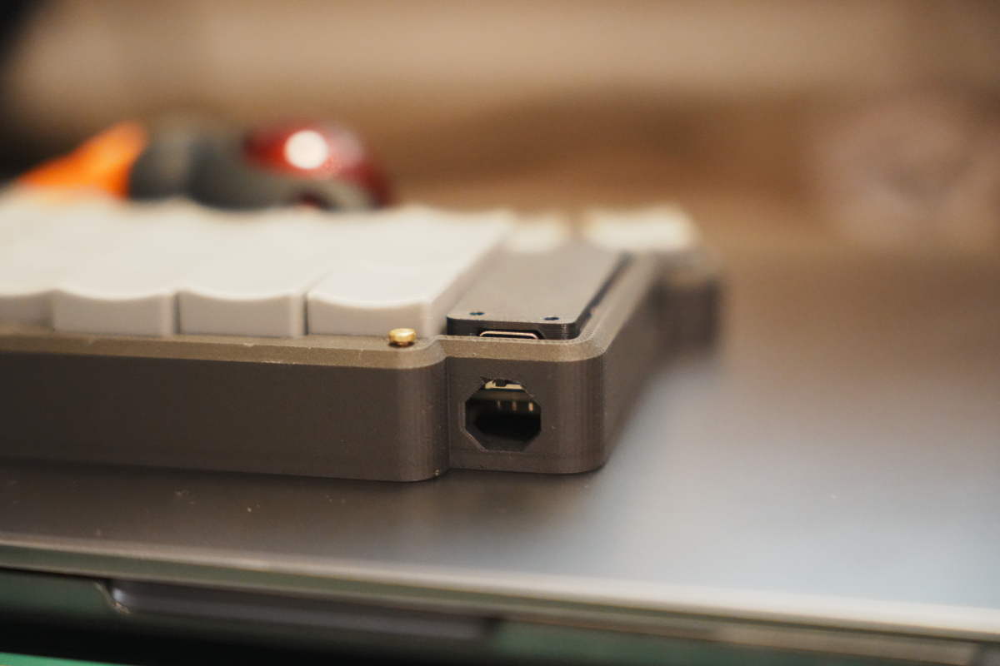

対応方法としては以下のいずれかになると思います。参考にしていただき、許容できると感じる方のみご購入をいお願いいたします。

- 充電やファームウェアの書き込みを行う際のみケースを外す
  - 手間ではありますが、バッテリー持ちは決して悪くないので現実的な選択肢だと思います。カバーに格納できる200mAhのバッテリーでも1~2週間ほどは充電無しで連続利用が可能です。
- 干渉する箇所を切る・削るなどの加工を行う
  - 加工する際は自己責任でお願いいたします。
- 専用ケースを使う
  - お手持ちのケースを使い続けることにこだわりが少ない方は、SeaSide39専用に設計したケースをお使いいただくことも可能です。底面に最大1000mAhまでの大容量バッテリーを搭載できるケースもありますのでぜひご検討ください。1000mAhのバッテリーを使用した場合、1ヶ月以上は充電無しで連続利用が可能です。

### 1-3．ZMKファームウェアの使用
SeaSide39では、マイコンがPro MicroからXIAO BLEに変更されるため、ファームウェアもQMKからZMKに変更となります。これにより、以下のような使い勝手の変化があることをご了承ください：

- Remap等のGUI上でのキーマップ変更ツールが使用できなくなります
  - SeaSide39はZMK Studioというツールにも対応しており、これを使用すればRemapに近い操作感でキーマップの変更も可能ではありますが、機能に制限があり、より複雑な設定を行う場合は結局ファームウェアを直接編集する必要が出てくることが多いです
- キーマップの変更や複雑な設定の変更にはGitHubを使用したファームウェアのビルドが必要になります
- Bluetoothの接続先の切り替えなど、無線特有の操作方法を覚える必要があります

ZMKファームウェアは比較的新しいファームウェアであるため、QMKと比較すると機能面で一部制限があります。しかし、無線化のメリットを享受するためには必要な変更となりますので、これらの違いを許容いただける方のみご購入をお願いいたします。

なお、ZMKファームウェアのビルドや書き込み方法については後述のビルドガイド内「[４．ファームウェア](#４ファームウェア)」セクションで詳しく説明します。

### 1-4．KeyballでできてSeaSideでできないこと

キーマップを含むQMKファームウェアでの設定内容はZMKに流用できないため、すべてご自身で同等の設定をし直していただく必要があります。あまりないとは思いますが、ファームウェアの違いにより実現自体できなくなる機能が存在する可能性もありますのでご了承ください。

また、ハードウェア面ではSeaSide39では以下の機能が使用できなくなります。
- RGBLEDは点灯しなくなります
- OLEDディスプレイが使用できなくなります（SeaSide39装着時にOLEDを接続しないでください）
- TRRSケーブルが使用できなくなります（SeaSide39装着時にTRRSケーブルを接続しないでください）
- Keyballのリセットボタンは機能しなくなります

これらの制限は無線化に伴う仕様変更によるものですので、あらかじめご理解いただけますようお願いいたします。

### 1-5．組み立ての大変さとLiPoバッテリーの取り扱い

無線化という性質上、このキットではLiPoバッテリーを扱います。また、細かいはんだ付け作業も必要となります。\
LiPoバッテリーの取り扱いには多少なりともリスクが伴います。他にもはんだ付け作業のミスによる基板や部品の損傷など、様々なトラブルが発生する可能性があります。\
当キットは個人開発のため、自己責任での組み立てとなること、およびすべてのトラブルに対応しきれない場合があることをご理解ください。

## ２．準備

制作を始める前に、まずは必要なものがすべて揃っていることをご確認ください。

### 2-1．キット同梱品確認

| 名前 | 数 | 備考 |
|:-|:-|:-|
| メイン基板右用 | 1枚 | |
| メイン基板左用 | 1枚 | |
| トラックボール用基板 | 1枚 | 省電力化のため置き換え |
| ポゴピン(2ピン) | 3本 | |
| コンスルー(12ピン) | 4本 | |
| トラックボール用センサー(PMW3610DM-SUDU) | 1個 | [データシート](https://www.alldatasheet.jp/datasheet-pdf/pdf/899003/PIXART/PMW3610DM-SUDU.html) |
| トラックボールセンサー用レンズ | 1個 | センサーに同梱されています |
| バッテリー用コネクタ | 2本 | JST 1.25mm 2pin|
| スライドスイッチ | 2個 | |
| マイコンカバー | 2個 | カバーセットを購入した方のみ |
| 専用ケース | 2個 | ケースセットを購入した方のみ |
| 大容量ケース | 2個 | 大容量ケースセットを購入した方のみ |
| 大容量ケース底部パーツ | 2個 | 大容量ケースセットを購入した方のみ |
| M2ネジ 8mm | 6本 | 大容量ケースセットを購入した方のみ |

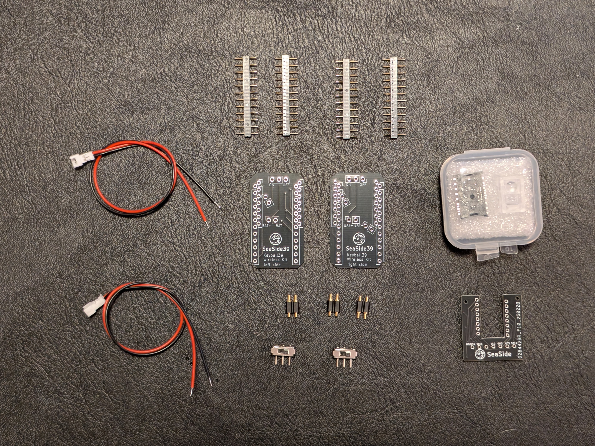

### 2-2．組立前にお客様自身で準備いただく部品

| 名前 | 数 | 備考 |
|:-|:-|:-|
| マイコン Seeed XIAO BLE nRF52840 | 2個 |  |
| Lipoバッテリー | 2個 | 推奨バッテリーについては後述します |
| バッテリーコネクタ | 2本 | 用意したバッテリーのコネクタがJST 1.25mmでない方のみ |

SeaSide39はamazonで購入できる以下のバッテリーのサイズを基準に設計していますので、以下のバッテリーの購入をおすすめします。どちらも2個入りで、JST 1.25mmコネクタ仕様になっているので付属のコネクタに接続可能です。\
これ以外のバッテリーを使用する場合、JST 1.25mmコネクタ以外のものを仕様するには別途コネクタを用意する必要があるためご注意ください。

200mAh : https://www.amazon.co.jp/dp/B08XJZZMN3 \
マイコンカバーにピッタリ格納できるサイズです。この大きさでも1〜2週間は充電無しで連続利用可能です。

1000mAh : https://www.amazon.co.jp/dp/B098DRP9WX \
大容量ケースにピッタリ格納できるサイズです。この大きさ以下であれば大抵のバッテリーが入るはずですので幅広くお選びいただけます。1000mAhあると、1ヶ月以上は充電無しで連続利用可能です。

### 2-3．必要な工具

SeaSide39の組み立てには下記の工具が必要です。

| 名前 | 備考 |
|:-|:-|
| はんだごて | 温度調整可能なもの推奨 |
| はんだ | |
| ニッパー|ピンヘッダの切断およびバッテリーコネクタ配線の被覆剥き用 |
| ドライバー ||
| ピンセット ||
| 両面テープ|バッテリー固定用|

## ３．組み立て

ここからはんだ付け作業に入ります。\
特に断りがない作業は左右の基板で同じ作業をすると読み取ってください。

### 3-1．ポゴピンの取り付け（一部）

マイコン背面のパッドで信号を受け取るためのポゴピンを取り付けます。
組み立ての都合で、現時点ではまだはんだ付けしない良いピンがあるので注意してください。

1. 写真を参考に、ポゴピンを装着する場所を確認します。右側は２箇所、左側は１箇所です。
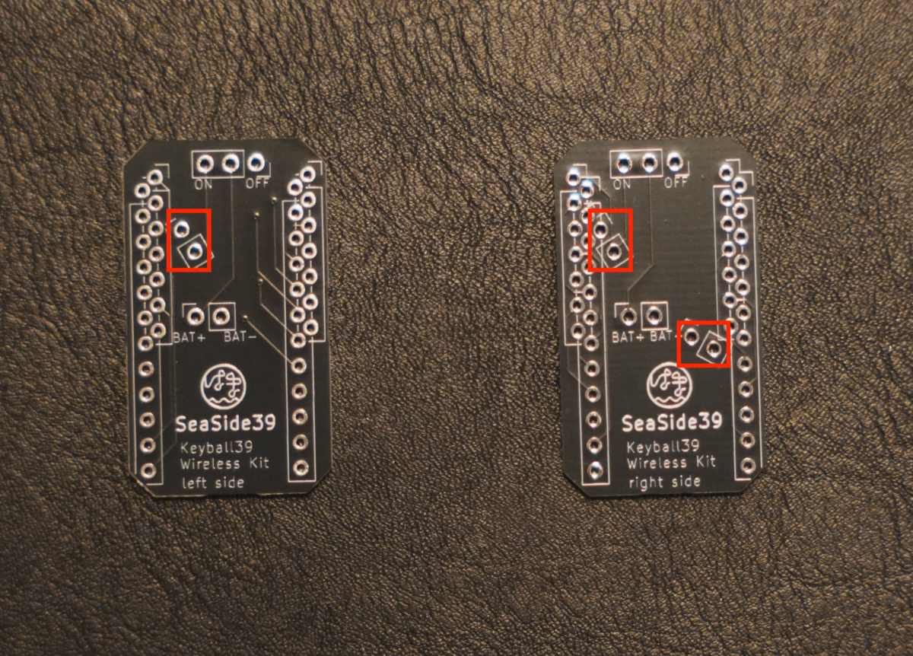

2. 対象のスルーホールにポゴピンを差し込みます。差し込む基板の面とポゴピンの向きを間違えないように注意してください。ロゴがある面に、段差があり根本まで差し込めないほうのピンを差し込むのが正解です。

3. 基板を裏返し、ポゴピンが固定されるようにマスキングテープなどで固定してください。裏面にポゴピンの足が少し飛び出していればOKです。

4. この状態でポゴピンの足をはんだ付けします。この時、右側基板のポゴピンの足を１本だけはんだ付けしないでおいてください。はんだ付けせずに残す箇所は画像で確認してください。左側基板はすべてはんだ付けしてOKです。
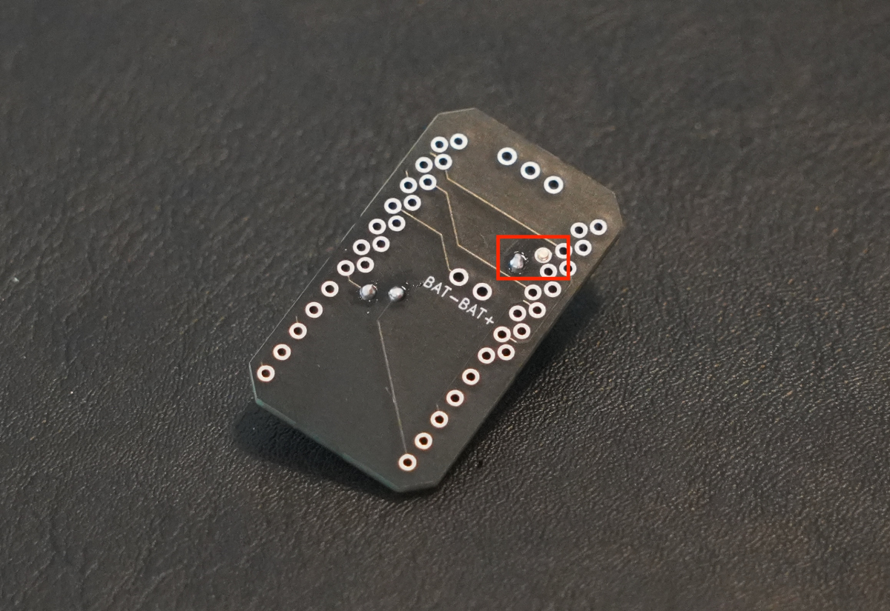

### 3-2．スイッチの取り付け

電源スイッチを基板に取り付けます。

1. スライドスイッチを基板の表面から差し込み、マスキングテープなどで固定します。この時、できるだけ基板の外側に寄せておくと専用ケースを装着した際にスイッチの操作が少しだけやりやすくなります。

2. 裏面からはんだ付けします。スイッチが浮かないように注意してください。
3. 気になる方ははみ出した足をカットしてください。

### 3-3．マイコンの足をカット

後の工程に備え、マイコン（Seeed XIAO BLE nRF52840）のピンを長さをカットします。

1. マイコンに付属のピンヘッダをマイコンにはんだ付けします。画像のようになればOKです。

   
2. マイコンの足を基板のスルーホールに差し込みます。差し込む箇所は画像で確認してください。
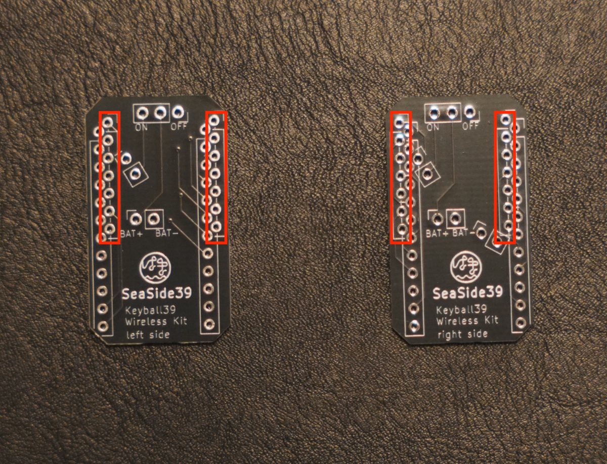

3. ポゴピンが押し込まれ、これ以上差し込めないことを確認したら、その状態でピンのはみ出している部分をニッパーでカットします。この時、完全に長さを合わせずにわずかにはみ出す程度の長さでカットしてください。画像のようになればOKです。

  
4. 長さを揃えることができたら、一度マイコンを抜きとります。この時、ギリギリでカットしすぎたりニッパーの質が悪いと、ピンの先端が変形し、マイコンがなかなか基板から抜けない場合があります。その場合は破損しないように注意しながら引き抜いてください。

### 3-4．バッテリーコネクタの取り付け

Lipoバッテリー用のコネクタを取り付けます。

1. バッテリーコネクタを任意の長さに切断します。長さは基本的に好みですが、長すぎてもケーブルの取り回しが難しくなることがあるので2~3センチメートル程度を推奨します。
2. ケーブルの被覆を2mmほど剥きます。ニッパーやカッターで剥けますが、ケーブルが細く慣れていないとケーブル自体を切断してしまうこともあるので、先程切ったケーブルの切れ端で練習してから挑むことをおすすめします。
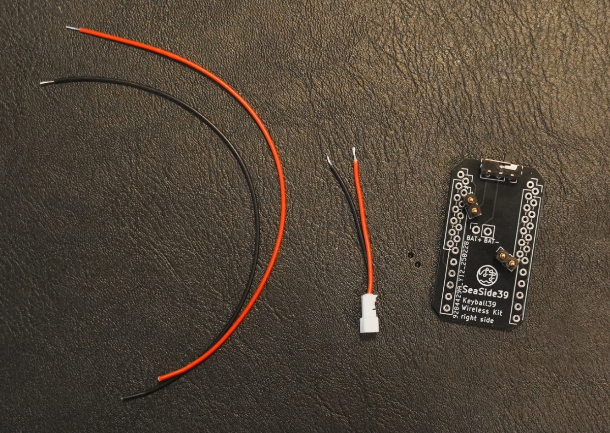

3. 基板の裏面からバッテリー端子用のスルーホールにはんだ付けします。この時、BAT+に赤色、BAT-に黒色を接続します。必ず間違えないように確認してください。バッテリーをマイコンカバーに格納する予定の方は画像の通り（基板下側向き）に、大容量ケースに格納する予定の方は逆方向（基板上側向き）にはんだ付けしたほうが少しだけケーブルが取り回しやすくなります。迷ったら画像の向きではんだ付けすればOKです。

### 3-5．コンスルーの取り付け

マイコンを装着するためのコンスルーピンを取り付けます。

1. Keyball39基板のOLEDとPro Microを取り外します。キーキャップやキースイッチなども取り外しておいたほうが作業性がよくなります。
2. コンスルーピンをKeyball基板の表面に差し込みます。差し込む穴は画像を参照してください。特に左側は、本家KeyballでPro Microを差し込んでいた場所と異なりますので注意が必要です。また、この時コンスルーピンには正しい向きがありますので、[本家Keyballのビルドガイド](https://github.com/Yowkees/keyball/blob/main/keyball39/doc/rev1/buildguide_jp.md#3-6promicro%E3%81%AE%E3%81%AF%E3%82%93%E3%81%A0%E4%BB%98%E3%81%91)を参考に差し込む向きもご確認ください。

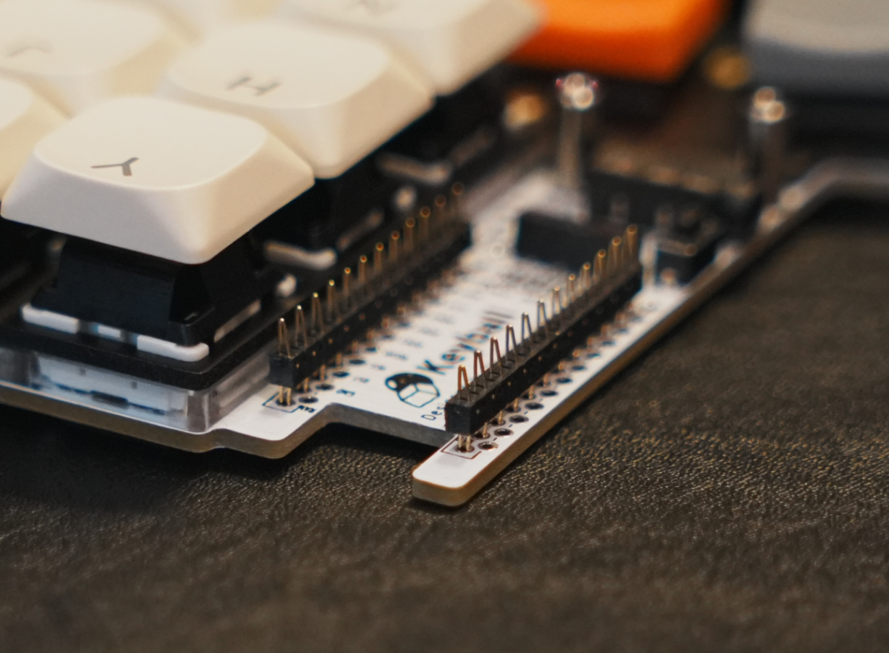

1. コンスルーピンを差し込んだら、その上からSeaSide39基板の基板を差し込みます。この時に、右側基板ではんだ付けせずに残して置いたポゴピンの足が干渉し隙間が空きやすいので、色々な角度から隙間を覗き、コンスルーを基板の間に隙間がないことをしっかりとご確認ください。

  以下の部分が特に隙間が空きやすいので注意。最悪隙間があっても動作に問題はないので、基板の傾きが気にならない方は神経質にならずに作業を進めてもOKです。
  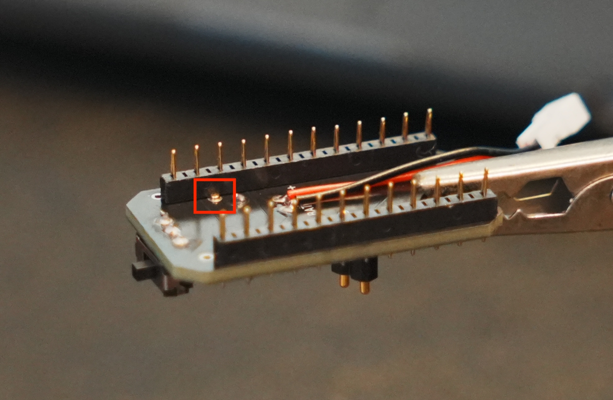

4. 隙間が無いことを確認したらコンスルーピンをはんだ付けして固定します。この時、はんだを盛りすぎるとマイコンを装着する際に干渉する場合があるので、少量のはんだで軽く接着するようなイメージではんだ付けを行ってください。コンスルーピンははんだ付けしなくても電気的に導通するので、ポゴピンやマイコン用のスルーホールと干渉するリスクのあるピン（画像赤枠のあたり）については無理にはんだ付けをする必要はありません。あくまでコンスルーが抜けてしまわないように固定するためにはんだ付けを行いますので、最悪四隅のピンだけでもはんだ付けできていればOKです。

### 3-6．ポゴピン残りのはんだ付け（右側のみ）

右側基板ではんだ付けせずに残して置いたポゴピンの足をはんだ付けします。

1. SeaSide39基板をKeyball39基板から外します。
2. 右側基板裏側の、はんだ付けがされていないピンにはんだ付けをします。コンスルーが干渉しているので、溶かしてしまわないようにだけ注意しながら短時間の加熱・少量のはんだでさっとはんだ付けを行います。
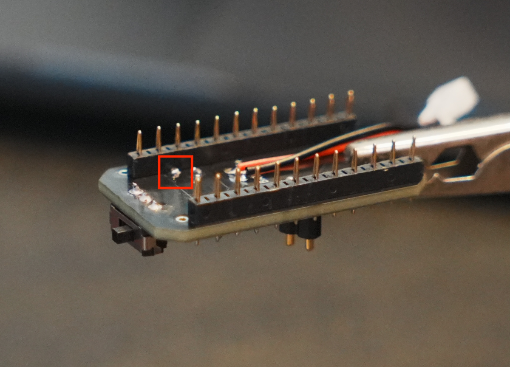

### 3-7．マイコンのはんだ付け

Seeed XIAO BLE nRF52840を基板に取り付けます。

1. マイコンを基板のスルーホールに差し込みます。
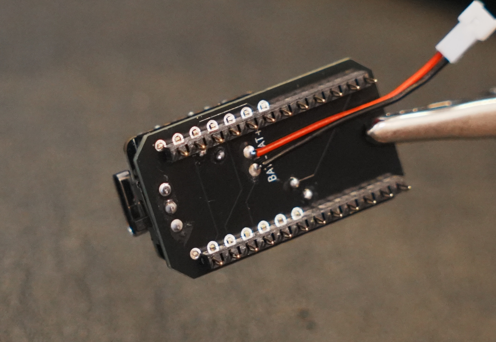
2. マイコンとSeaSide39基板が平行になっていることを確認します。
3. 先ほどのポゴピンの足と同様に、こちらもコンスルーと干渉していますので溶かしてしまわないよう注意しつつ、さっとはんだ付けをします。
4. 画像のようになればOKです。

### 3-8．トラックボールセンサーのはんだ付け

省電力タイプのトラックボール読み取りセンサーを基板に取り付けます。

1. センサーを基板に差し込みます。画像を参考に、向きを間違えないようにしてください。
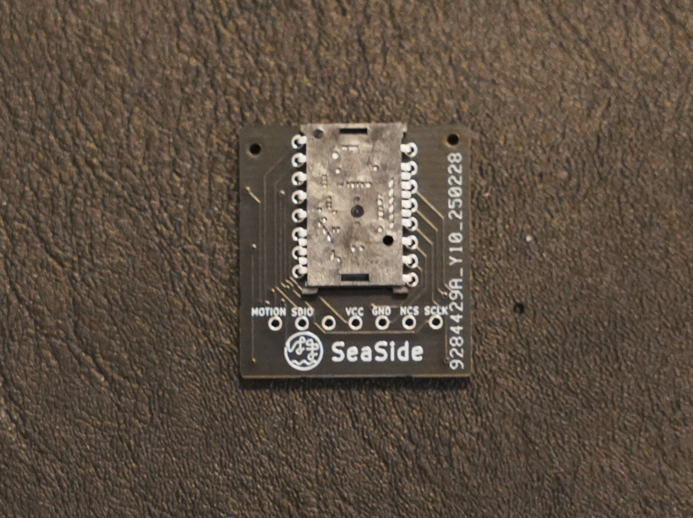
2. すべてのピンにはんだ付けをし、センサーの保護シールを剥がします。はんだ付けの際に、はんだごてが表面実装の部品に触れてしまわないよう注意してください。
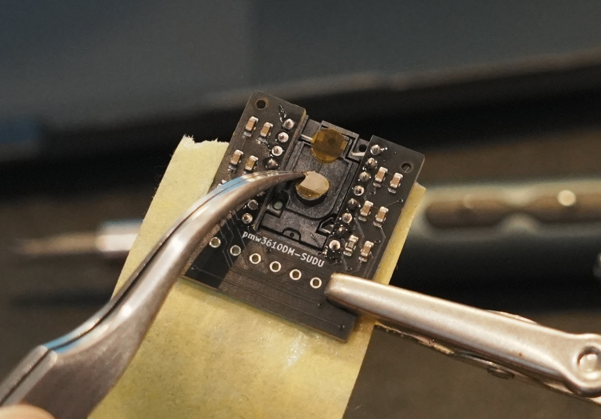
3. センサー用レンズを差し込みます。画像を参考に、向きを間違えないようにしてください。

以上ではんだ付けは完了です。お疲れさまでした！\
スライドスイッチをオン（左側）に入れ、USBケーブルを繋ぐと充電インジケータが緑色に光り、充電されていることが確認できるはずです。

### 3-9．組み立て

ここまでの作業でSeaSide39の主要部分の組み立ては完了しました。最後にKeyball39基板への装着とカバーおよびケース（オプションパーツ）の取り付けを行います。購入されたパーツに応じて必要な作業だけを行ってください。また、作業中はSeaSide39のスイッチをオフ（左側）にしたままにしておいてください。

1. バッテリーコネクタの向きを確認します。大容量ケースを使用しない方は、コネクタケーブルを基板下側へ向け、大容量ケースを使用する方は基板上側に向けます。大容量ケースを使用する、かつ下向きにコネクタをはんだ付けした方は、画像のようにコネクタケーブルを曲げて基板上側に向けます。
  このとき、ケーブルの根本に負荷がかかると断線するおそれがあるので優しく取り扱ってください。
  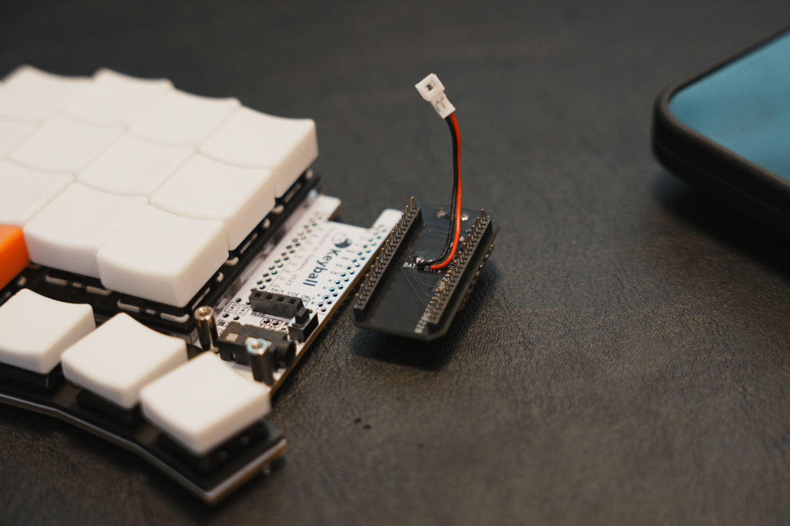
  
1. SeaSide39をKeyball39基板に装着します。差し込む穴は画像の通りです。
  
  大容量ケースを使用しない方は、画像のようにOLED用のピンソケットを避けるように隙間を通してください。ソケットと基板でケーブルを挟みこんでしまわないように注意します。
  
  大容量ケースを使用する方は、Keyball39基板の底面側に出るようにケーブルを通してください。
  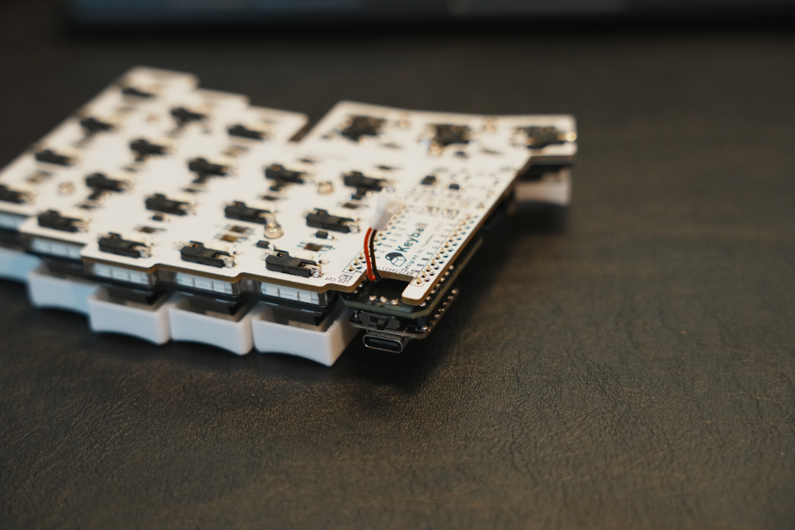

1. バッテリーを装着します。  大容量ケースを使用しない方は、マイコンカバーの裏面に両面テープで200mAhバッテリーを固定しコネクタを接続します。画像を参考に、組み立てた時にXIAO BLEと干渉しないように位置決めをしてください。
  
  ケーブルがはみ出さないように注意しつつ、隙間に押し込みながらカバーをネジ止めします。
  
  写真のようにUSBコネクタとカバーの位置が合っていればOKです。
  
  大容量ケースを使用する方は、先にケースを装着する必要があります。画像のようにコネクタを穴から下に出し、赤く囲ったネジだけを固定します。
  
  大容量ケースの底面パーツにバッテリーを両面テープで固定し、コネクタを接続します。
  
  ケーブルがはみ出さないように注意しつつ、隙間に押し込みながらカバーを閉じます。
  
  残りのネジを締めます。底面パーツのネジ止めは、大容量ケースに付属の8mmネジを使用します。写真のように隙間が空いていなければOKです。
  
  専用ケースおよび大容量ケースどちらの場合も、画像のようにコネクタとスイッチが位置がケースに合っていることを確認してください。
  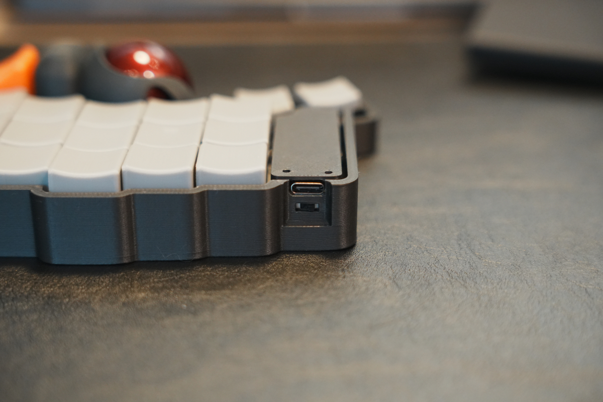

1. トラックボール読み取り基板を元のKeyball39のものからSeaSide39のものに置き換えます。Keyball39のものと互換性がありますので、基板を差し替えるだけでOKです。

3. 基板の差し替えが済んだら、トラックボールケースを元通りに装着しケースに固定します。

## ４．ファームウェア

comming soon...